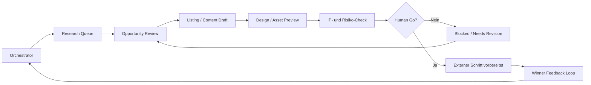

# Architektur · Klause/OpenClaw

Die öffentliche Architektur zeigt die Kontrolllogik. Sie veröffentlicht keine echten Laufzeitdaten, Prompts, Tokens, Accountdetails oder Plattform-Endpunkte.

## Rollen

| Rolle | Aufgabe | Öffentliche Darstellung |
| --- | --- | --- |
| Orchestrator | Systemzustand lesen, Blocker priorisieren, nächste Aktionen bestimmen | Kontrollzentrum |
| Research | Chancen sammeln, Nachfrage/Risiko bewerten | Research Queue |
| Listing/Content | Entwürfe, Tags, Beschreibungen und Assets vorbereiten | Draft-Lane |
| Digital Listing | digitale Produktpakete vorbereiten | separate Lane |
| Winner Feedback | Signale aus Ergebnissen zurückspielen | Feedback Loop |
| IP-/Compliance Guard | riskante Motive, Claims oder externe Schritte blockieren | Review-Gate |

## Detailtreue

Originalquellen zeigen einen Etsy-/Marketplace-Kontext mit Orchestrator, Research, Listing, Digital Listing, Winner Loop, TikTok/Content und IP-/Compliance Guard. Öffentlich wird das als kontrolliertes Agentensystem beschrieben, nicht als frei laufendes externes System.

## Kernentscheidung

Agenten dürfen Aufgaben vorbereiten. Externe Aktionen brauchen erkennbare Freigabe, ausreichende Konfiguration und Risikoprüfung.

