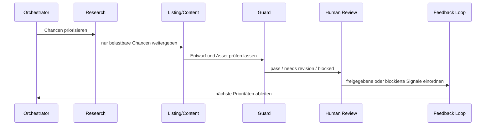

# Workflow · Klause / OpenClaw

## Ablauf

1. Orchestrator liest den Systemzustand.
2. Research-Agent sammelt und bewertet Chancen.
3. Niedrige Qualität oder riskante Themen werden blockiert.
4. Listing-/Content-Agent erzeugt Entwürfe und Asset-Briefs.
5. Design-Preview bewertet visuelle Qualität.
6. IP-/Risk-Guard prüft Marken-, Claim- und Veröffentlichungsrisiken.
7. Externe Schritte bleiben blockiert, bis Konfiguration, Qualität und menschliche Freigabe passen.
8. Winner Feedback Loop spielt Signale zurück in Research und Priorisierung.

## Warum das relevant ist

Der relevante Punkt ist nicht, dass Agenten “magisch” handeln. Entscheidend ist, dass Agentenarbeit kontrollierbar wird:

- Rollen trennen
- Status sichtbar machen
- Risiken früh blockieren
- externe Schritte nicht blind auslösen
- aus Feedback neue Prioritäten ableiten
